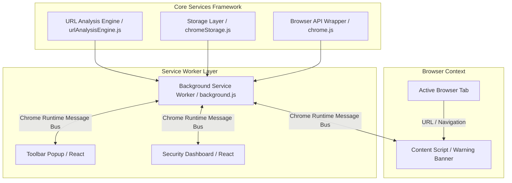

# Gorillaz Guard - Architecture Blueprint

## Architectural Overview Diagram

---

## Key Modules & Responsibilities

### 1. Extension Entry Points (`public/manifest.json`)
- **Background (`background.js`)**: Non-persistent service worker reacting to `chrome.tabs.onUpdated`, `chrome.tabs.onActivated`, and `chrome.runtime.onMessage`.
- **Content Script (`content.js`)**: Injected into web pages to display glassmorphic security warning overlays on high-risk domains.
- **Popup (`popup.html` / `PopupPage.jsx`)**: Responsive 380px glassmorphic popup accessible from the browser toolbar.
- **Options (`options.html` / `DashboardPage.jsx`)**: Full-page glassmorphic dashboard for analytical reports, history breakdown, whitelist manager, and security preferences.

### 2. Services (`src/services/`)
- **`services/url/`**: Pure functions for detecting HTTP, IP-based URLs, URL shorteners, excessive subdomains, brand spoofing keywords, unsafe ports, and safety score calculations.
- **`services/browser/`**: Wrapper around `chrome.tabs`, `chrome.runtime`, and `chrome.action` with mock fallbacks for standalone web dev.
- **`services/storage/`**: Promise-based wrapper around `chrome.storage.local` managing user preferences, whitelist, and threat logs.

### 3. Design System (`src/components/`)
- Atomic glassmorphic components (`GlassContainer`, `Badge`, `ToggleSwitch`, `SecurityScoreCard`, `WebsiteDetailsCard`, `ThreatCard`, `StatCard`, `ScanChartCard`, `RiskBreakdownCard`).
- Decoupled from business logic using custom React hooks (`useUrlAnalyzer`, `useDashboardData`, `useSettings`).
