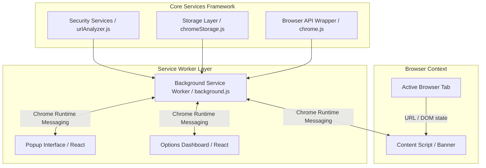

# Browser Guard - Architecture Blueprint

## Architectural Diagram

---

## Key Modules & Responsibilities

### 1. Extension Entry Points (`public/manifest.json`)
- **Background (`background.js`)**: Non-persistent service worker reacting to `chrome.tabs.onUpdated` and `chrome.runtime.onMessage`.
- **Content Script (`content.js`)**: Injected into web pages to display critical security warning banners on high-risk domains.
- **Popup (`popup.html` / `Popup.jsx`)**: Responsive 380px glassmorphic popup accessible from the browser toolbar.
- **Options (`options.html` / `Dashboard.jsx`)**: Full-page glassmorphic dashboard for analytical reports, history breakdown, and security preferences.

### 2. Services (`src/services/`)
- **`services/security/`**: Pure functions for detecting IP-based URLs, URL shorteners, excessive subdomains, brand spoofing keywords, and safety score calculations.
- **`services/browser/`**: Wrapper around `chrome.tabs`, `chrome.runtime`, and `chrome.history` with mock fallbacks for standalone dev testing.
- **`services/storage/`**: Promise-based wrapper around `chrome.storage.local` managing user preferences, whitelist, and threat logs.

### 3. Design System (`src/components/`)
- Atomic glassmorphic components (`GlassContainer`, `Card`, `Badge`, `Toggle`, `Modal`, `PrimaryButton`).
- Decoupled from logic to ensure maximum reusability across Popup and Options/Dashboard.
