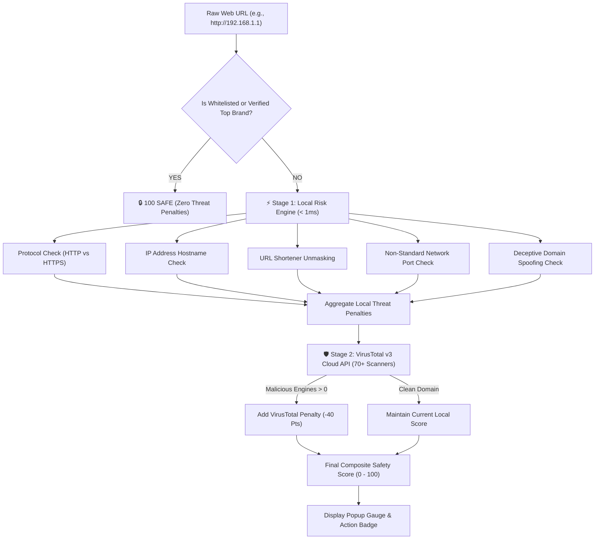

# Gorillaz Guard 🦍🛡️ - Security Engine & VirusTotal API Architecture

## 1. Executive Summary & Direct Answer

> **Is the Safety Score (0 - 100) generated only by VirusTotal, or is it processed by both engines?**  
> 
> **Answer**: The Safety Score is a **Hybrid Composite Score** calculated after being processed by **BOTH** engines working in tandem:
> 1. **Stage 1**: The **On-Device Local Risk Engine** performs instant (< 1ms) client-side structural and protocol threat analysis.
> 2. **Stage 2**: The **VirusTotal v3 Cloud Intelligence API** queries 70+ global antivirus scanners in real-time.
> 3. **Composite Scoring**: Penalties from **both** engines are aggregated and deducted from a base score of 100 to produce the final **Safety Score (0 - 100)** and safety level (**SAFE**, **WARNING**, or **DANGEROUS**).

---

## 2. Dual Engine Architecture Breakdown

---

## 3. Engine 1: On-Device Local Risk Engine

The **Local Risk Engine** (`urlDetector.js` & `urlAnalysisEngine.js`) runs locally inside the user's browser in under 1 millisecond. It uses a deterministic heuristic threat model without relying on external network connectivity.

### Heuristic Rule Set & Penalties

| Threat Vector | Detection Condition | Severity | Penalty |
| :--- | :--- | :---: | :---: |
| **Unencrypted HTTP** | Web connection uses `http://` instead of `https://` | `HIGH` | **-30 Pts** |
| **Numerical IP Hostname** | Hostname is a raw IPv4/IPv6 address (e.g. `192.168.1.1`) | `HIGH` | **-35 Pts** |
| **Link Shortener** | Domain masks real destination (`bit.ly`, `tinyurl.com`, `t.co`) | `MEDIUM` | **-15 Pts** |
| **Excessive Subdomains** | Subdomain depth exceeds 2 levels on unverified domains | `MEDIUM` | **-20 Pts** |
| **Unsafe Port** | Uses non-standard network ports (e.g. `:8888`, `:8080`) | `HIGH` | **-25 Pts** |
| **Domain Spoofing** | Domain contains deceptive phrases (e.g. `github-login-verify.xyz`) | `HIGH` | **-25 Pts** |
| **Obfuscated URL** | Hex-encoded characters masking original text | `LOW` | **-10 Pts** |

---

## 4. Engine 2: VirusTotal v3 Cloud Threat Intelligence API

The **VirusTotal API Engine** (`virusTotalService.js`) integrates live threat intelligence from VirusTotal's v3 REST API endpoint (`https://www.virustotal.com/api/v3/domains/{domain}`).

### Key Capabilities
1. **70+ Antivirus Scanner Consensus**: Queries global security vendors simultaneously, including **Kaspersky**, **Sophos**, **Bitdefender**, **Symantec**, **ESET**, and **Google Safe Browsing**.
2. **Dynamic Reputation Scoring**: Retrieves last analysis stats (`malicious`, `suspicious`, `harmless`, `reputation`).
3. **Malicious Threat Penalty**: If any security engine flags the domain as malicious, a high-severity **-40 Points** penalty (`VIRUSTOTAL_MALICIOUS`) is added to the report.
4. **Persistent In-Memory Caching (`vtCache`)**: Caches lookups per session to minimize API calls and respect VirusTotal rate limits.

---

## 5. Composite Safety Score Mathematical Formula

$$\text{Safety Score} = \max\left(0, \, 100 - \sum \text{Local Penalties} - \text{VirusTotal Penalty}\right)$$

### Discrete Safety Levels
- **80 – 100 SAFE (Green Badge)**: Secure HTTPS connection, clean domain, 0 antivirus detections.
- **50 – 79 WARNING (Amber Badge)**: Link shorteners, minor score deductions, or unencrypted HTTP.
- **0 – 49 DANGEROUS (Red Badge)**: Raw IP hostnames, VirusTotal malicious flags, or active phishing spoofing attempts.

---

## 6. Verification Example Scenarios

### Scenario A: `https://github.com/login`
- **Local Engine**: Verified Brand Platform (0 penalties).
- **VirusTotal API**: 0 malicious flags.
- **Composite Score**: **100 SAFE** ✅

### Scenario B: `http://github-verify-login.xyz`
- **Local Engine**: Unencrypted HTTP (-30 pts) + Domain Spoofing (-25 pts) = **45 pts**.
- **VirusTotal API**: 3 Antivirus Engines Flagged Malicious (-40 pts).
- **Composite Score**: $\max(0, 100 - 55 - 40) = \mathbf{5\text{ DANGEROUS}}$ ❌
